# 🐄 Kurbandaş – Kurban Paylaşım ve Organizasyon Platformu

**Kurbandaş**, Kurban Bayramı’na özel olarak geliştirilen, kullanıcıların kurban paylaşımı
yapmasını, paydaşlarla iletişime geçmesini ve tüm süreci dijital ortamda yönetmesini sağlayan mobil
öncelikli bir platformdur.

## 📲 Özellikler

- 🔐 Google ve Apple kimlik doğrulama ile güvenli giriş
- 📸 Kurban ilanı oluşturma, fotoğraf yükleme ve detaylı bilgi ekleme
- 🤝 Kurban paylaşımı: Yeni Kurban oluştur veya mevcut bir Kurban'a katıl
- 📍 İl/İlçe bazlı konum filtreleme ile yerel eşleşme
- 📞 Giriş sonrası telefon paylaşımı ile güvenli iletişim
- ☁️ Supabase entegrasyonu: Auth, Storage, Realtime DB, Edge Functions
- ⚙️ **Supabase Edge Function**: Kurban kaldırıldığında görseller Storage'dan kullanıcıyı
  bekletmeden arka planda otomatik olarak silinir
- 🛠️ CI/CD süreci: GitHub Actions kullanılarak DigitalOcean Droplet üzerine otomatik deployment
- 🌐 Çok dilli destekli Flutter arayüz
- 🧭 Yardım ve destek bölümü, kullanıcı dostu arayüz

## 🛠️ Teknolojiler

- **Flutter** – Mobil arayüz
- **C# .NET 8 Web API** – REST mimarisiyle backend
- **Supabase** – Auth, Storage, Database, Edge Functions
- **PostgreSQL** – Veritabanı
- **DigitalOcean Droplet** – Hosting
- **GitHub Actions** – CI/CD

## 🎯 Amacımız

Kurban ibadetini dijital bir deneyime dönüştürerek kullanıcılar için süreci daha **erişilebilir,
şeffaf ve pratik** hale getirmek.

---

## 🖼️ Uygulama Ekran Görüntüleri

<a href="ss/Login_Page.png" target="_blank">
  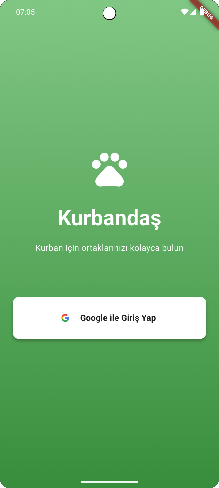
</a>

<a href="ss/Home_Page.png" target="_blank">
  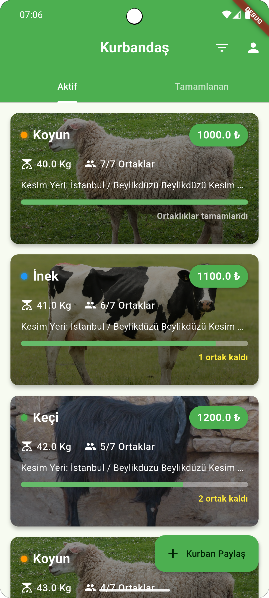
</a>

<a href="ss/Create_Kurban_Page-Basic_Info.png" target="_blank">
  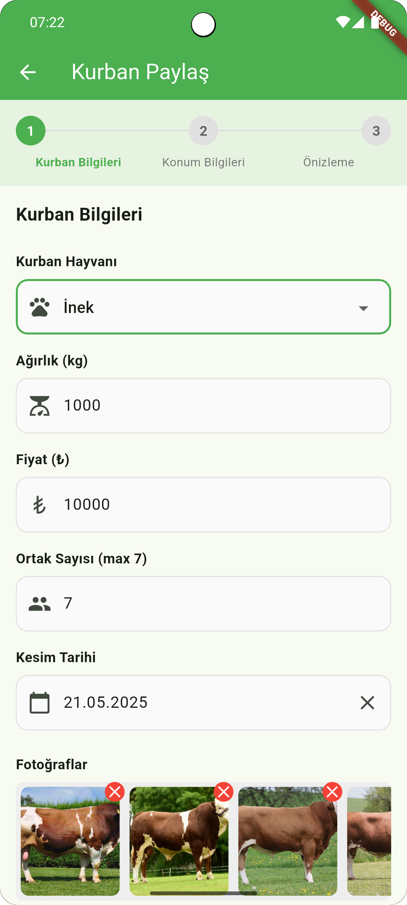
</a>

<a href="ss/Create_Kurban_Page-Location.png" target="_blank">
  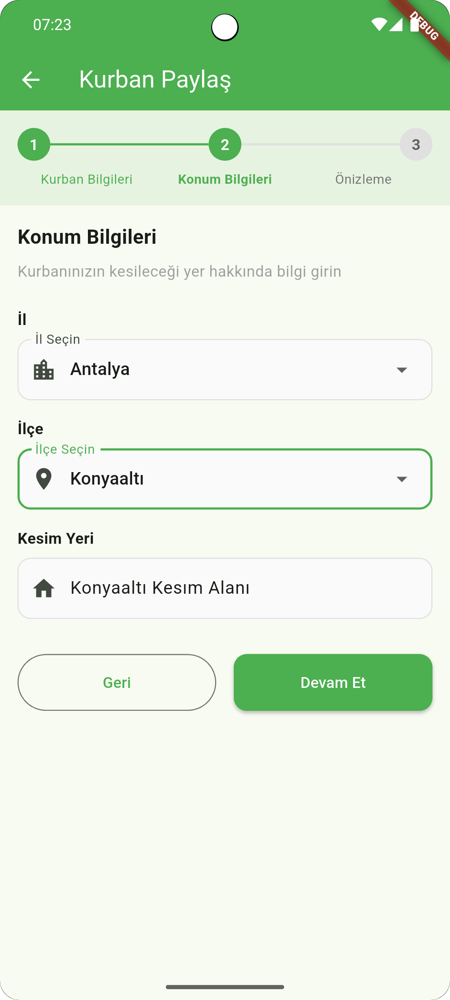
</a>

<a href="ss/Create_Kurban_Page-Preview.png" target="_blank">
  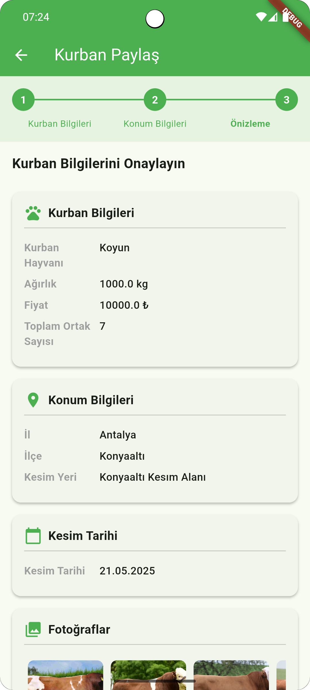
</a>

<a href="ss/Edit_Kurban_Page.png" target="_blank">
  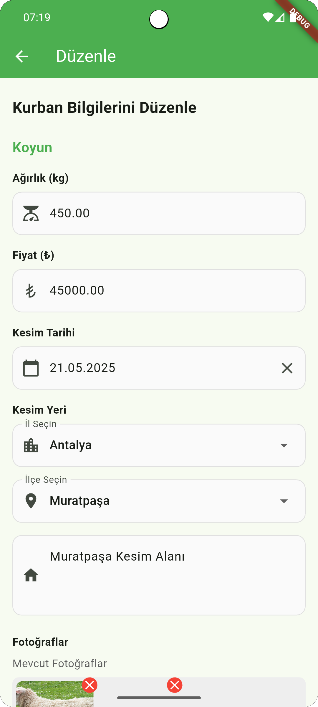
</a>

<a href="ss/Filter_Bottom_Sheet.png" target="_blank">
  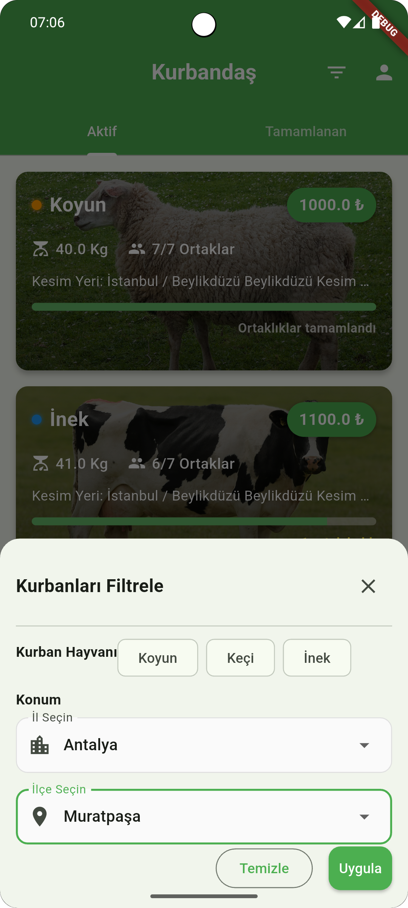
</a>

<a href="ss/Kurban_Detail_Page.png" target="_blank">
  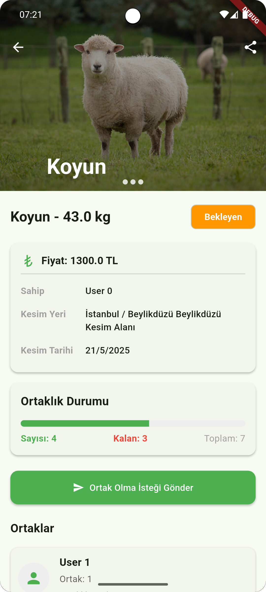
</a>

<a href="ss/Kurban_Detail_Page-Partners.png" target="_blank">
  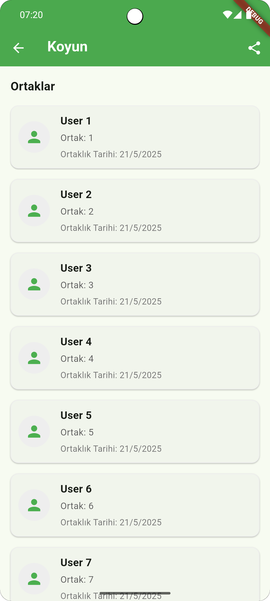
</a>

<a href="ss/Kurban_Requests_Page-Approved.png" target="_blank">
  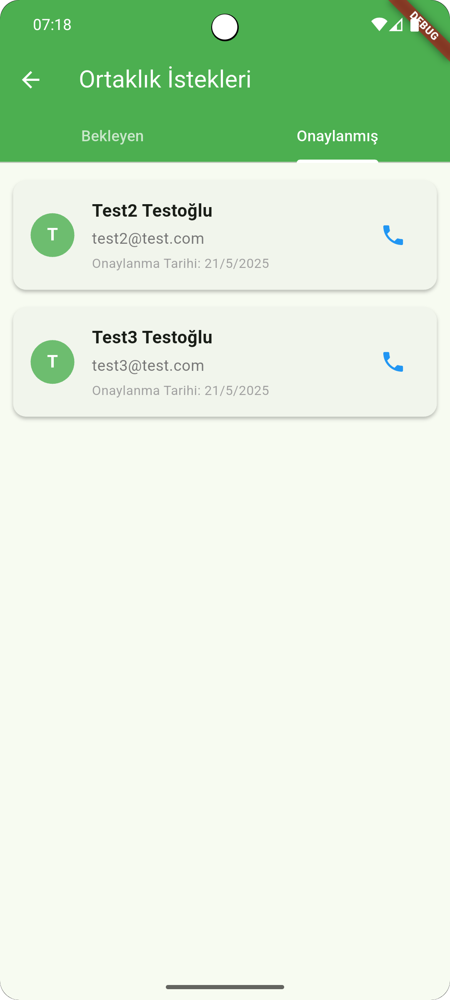
</a>

<a href="ss/Kurban_Requests_Page-Waiting.png" target="_blank">
  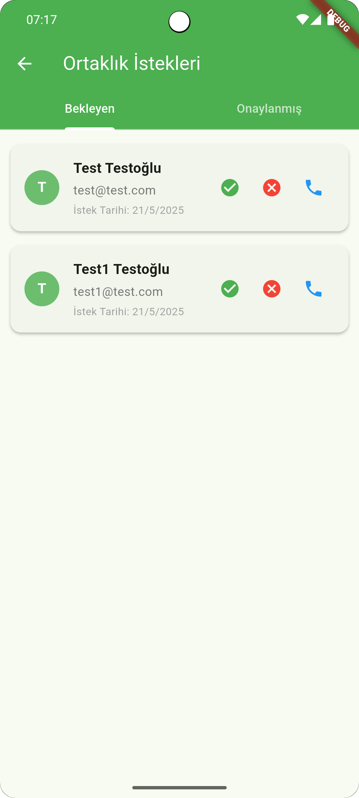
</a>

<a href="ss/My_Partnerships_Page.png" target="_blank">
  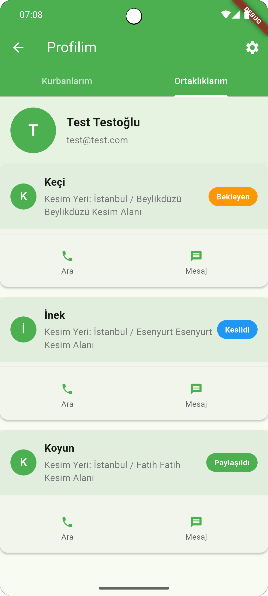
</a>

<a href="ss/Profile_Page.png" target="_blank">
  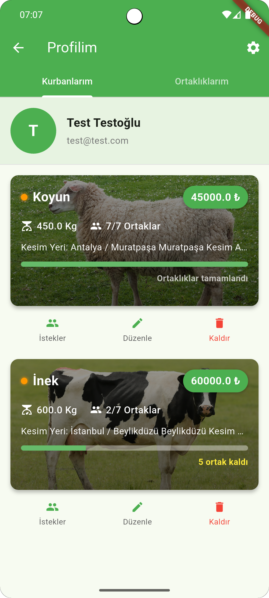
</a>

<a href="ss/About_Page.png" target="_blank">
  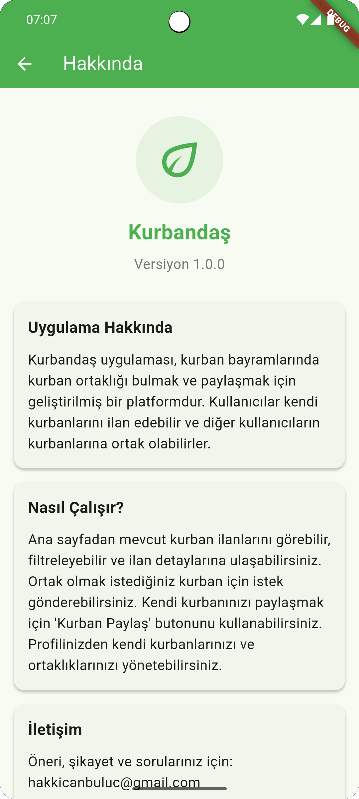
</a>

<a href="ss/Help_Page.png" target="_blank">
  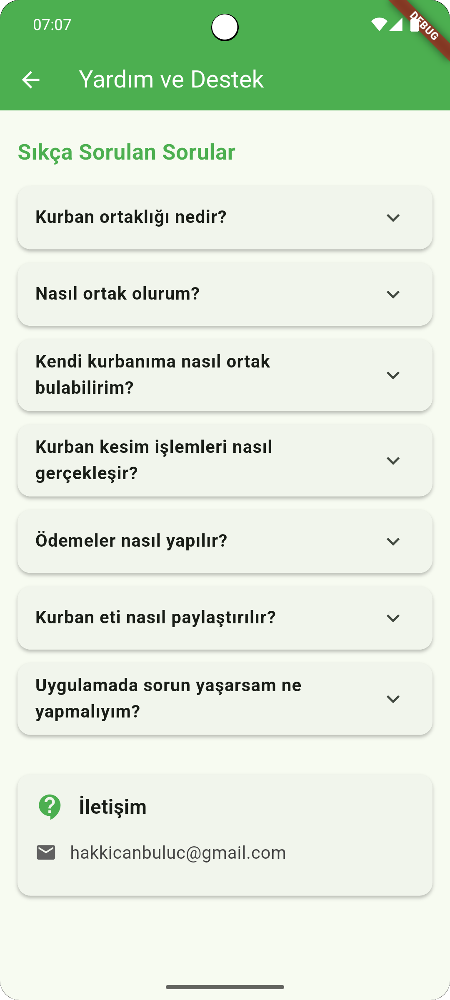
</a>

---

## 📦 Kurulum

```bash
git clone https://github.com/Ahmetcan7307/KurbandasApp.git
cd KurbandasApp
flutter pub get
flutter run
```

## 🤝 Katkıda Bulun

Pull request’ler her zaman açıktır. Yeni özellik önerileri veya hata bildirimleri için issue
oluşturabilirsiniz.

## 📄 Lisans

Bu proje MIT Lisansı ile lisanslanmıştır.

Görüşlerinizi ve katkılarınızı bekliyoruz!